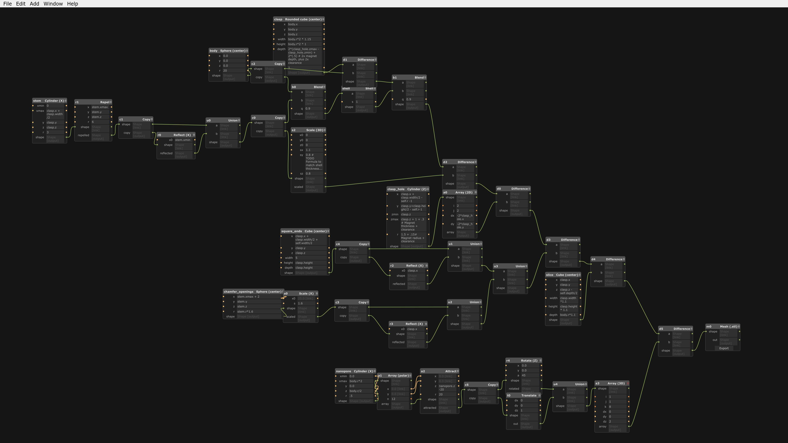

# Magnetic moss holder for air layering

Air layering is a plant propagation technique for triggering root development at specific locations on certain plants. It usually involves binding wet moss to a plant's stem. Cuttings taken from the rooted nodes will have a higher survival rate.

I made this clip-on moss holder for that purpose. There are similar items on amazon, but I wanted to make a parametric model that could accommodate a range of stem diameters and moss volumes. It consists of two symmetrical halves that snap together using magnets.

### Usage notes

Pack each half with spaghnum moss, and clip it to the plant. Keep moist at all times.

I don't really recommend using this. There are too many air holes, so it dries out too fast. But I think they look cool, so I'm not going to remove them. It would be more exciting to compensate by adding a barb fitting for a slow drip system anyway.

### Build notes

Printed successfully using an SLA printer with Elegoo clear resin at a 0.05mm layer height. Ensure that the magnet holes are oriented for good drainage, and clean them carefully. It's a tight fit and excess resin will interfere.

You'll need to print two halves and provide 8x neodymium magnets. Take care to align the magnets properly so that the two halves will attract each other. Use super glue to secure the magnets.

### Images

