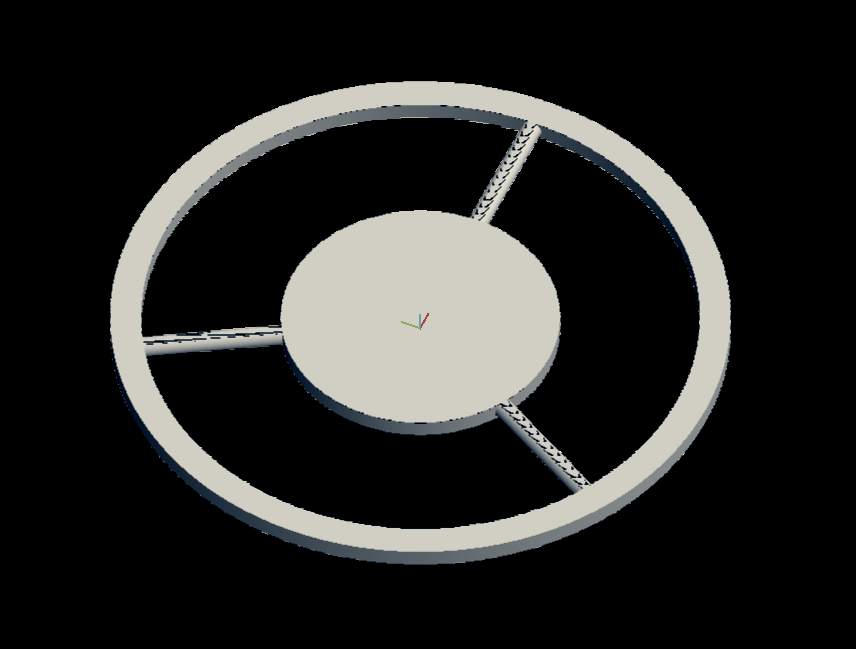
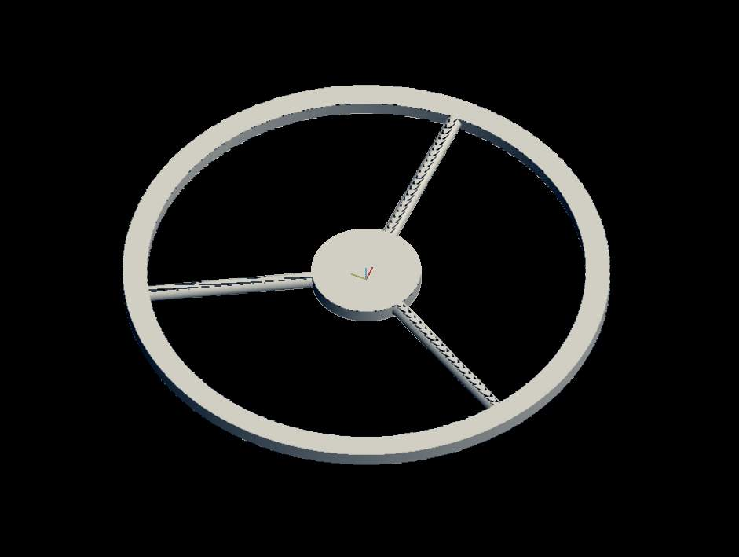
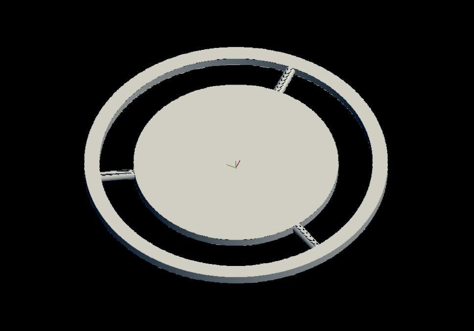
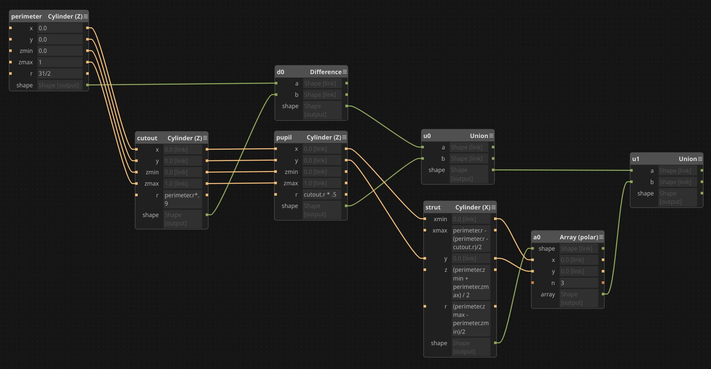

# Darkfield filter for microscopy

Traditional microscopy relies on light shining through the specimen, into the scope's objective lens. This is referred to as _brightfield_ microscopy, because whatever you're looking at appears on a bright background (your light source).

There's an alternative technique called _darkfield_ microscopy. A darkfield filter blocks out the center of your light source, so no light enters the microscope's lens. Sounds like we're off to a bad start here, but thanks to diffraction, light bends around the filter. There's a point where those bent rays meet back up and form a focal point. When the specimen is positioned precisely at that point it'll be lit from the sides, and bounce that light up into the microscope lens. This is handy for viewing translucent objects, but more importantly, it looks really cool.

There's probably a diagram on the [wikipedia](https://en.wikipedia.org/wiki/Dark-field_microscopy) page.

### Build notes

You'll want to adjust the radius of the `perimeter` to suit your condenser, and the `pupil` to suit your objective lens. Units are millimeters.

### Images

