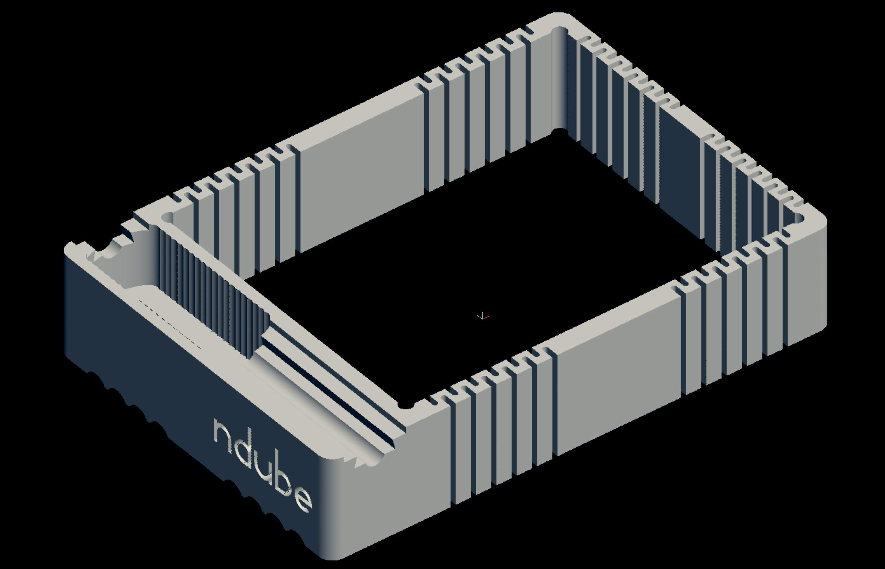
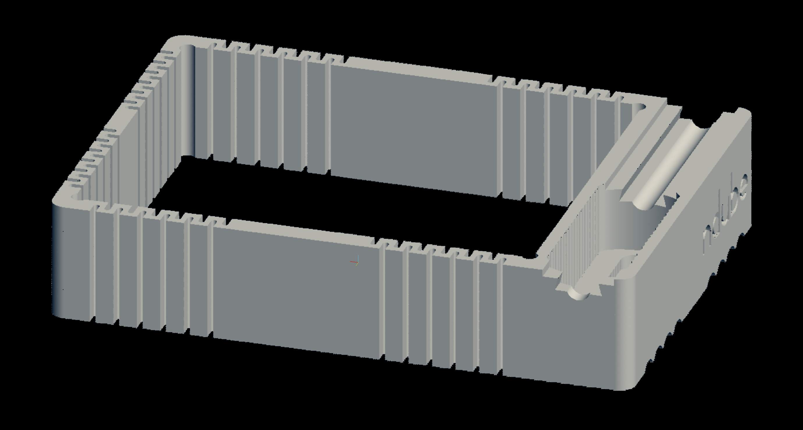
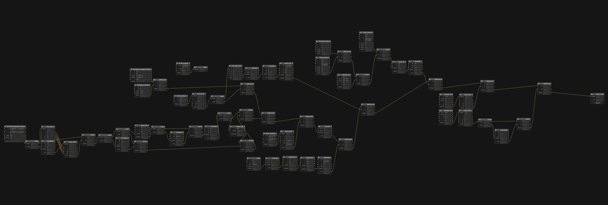

# Dial indicator mount for 3d printer

I wanted to mount a dial indicator to my 3d printer's extruder to help level my print bed. The zig-zag feature is a compliant mechanism that allows the part to stretch. It fits snugly around a stock Creality extruder assembly, and it is quick to install or remove.

### Usage notes

I don't think it's necessary to level a print bed using a dial indicator, so I don't recommend using this.

### Build notes

Printed successfully using an FDM printer with a 0.4mm hotend using PETG.

### Images

