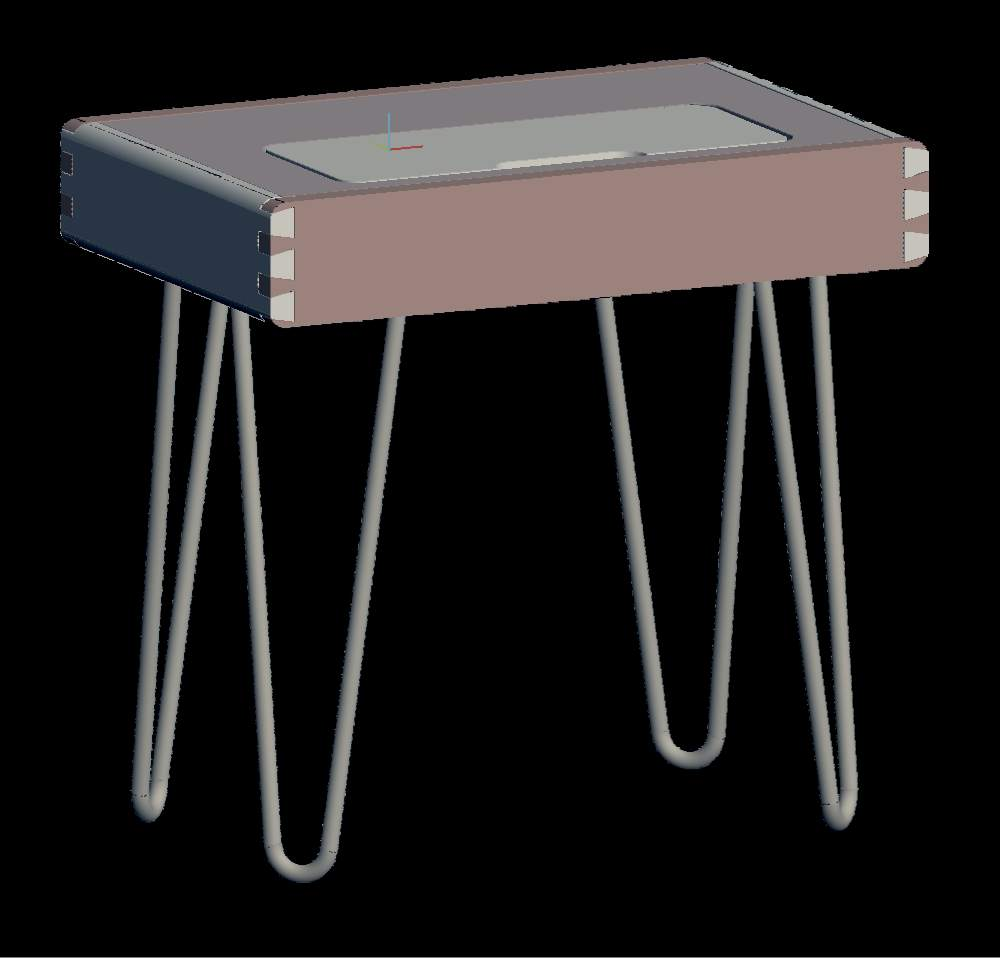
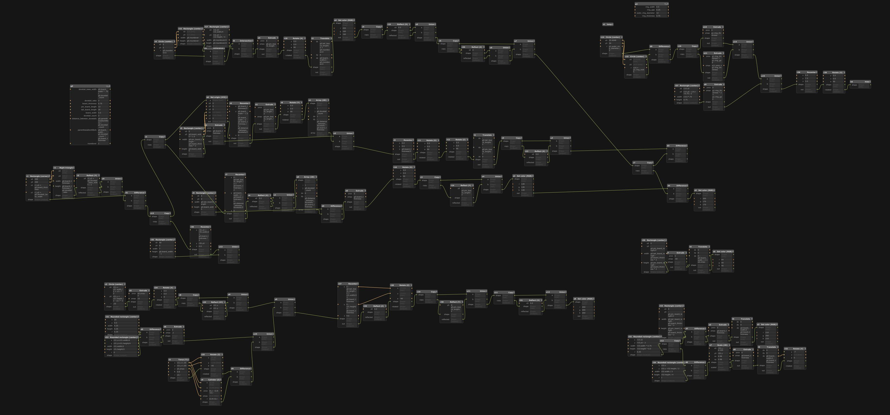
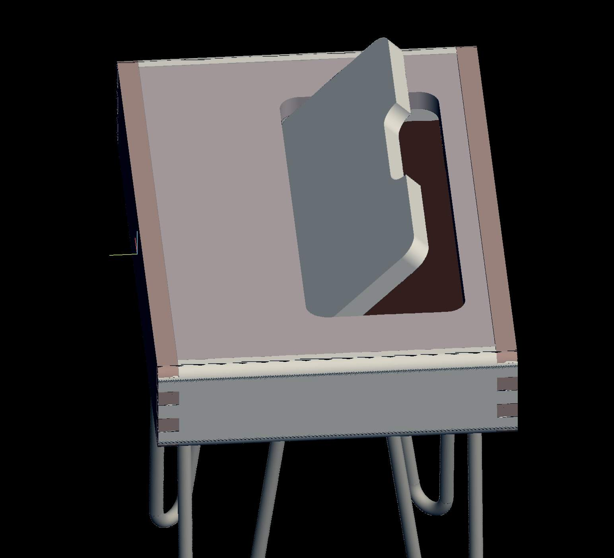
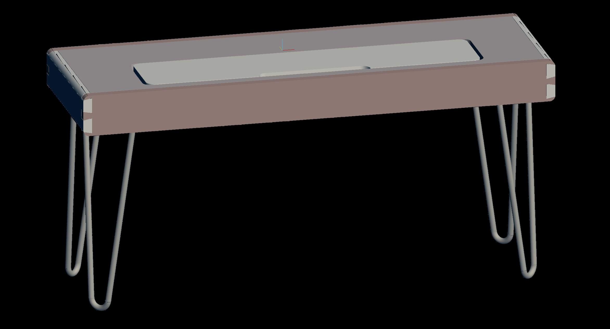
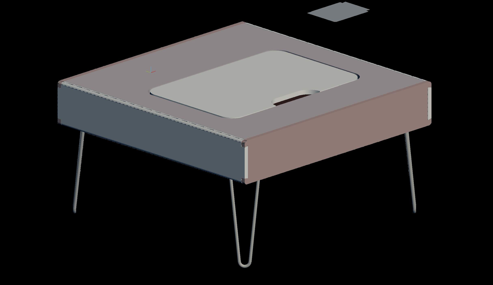
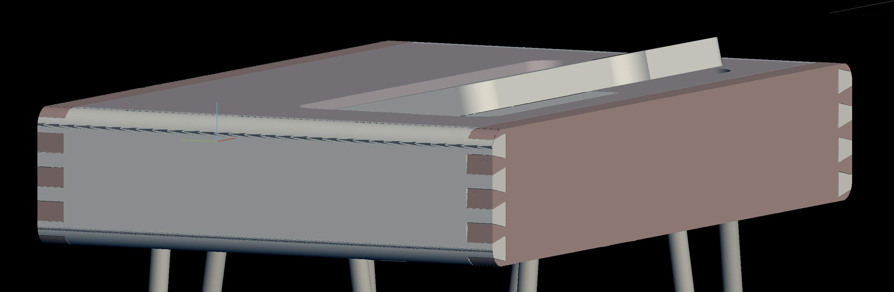
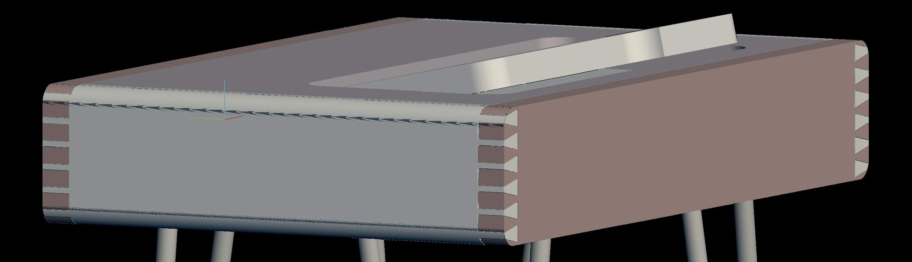
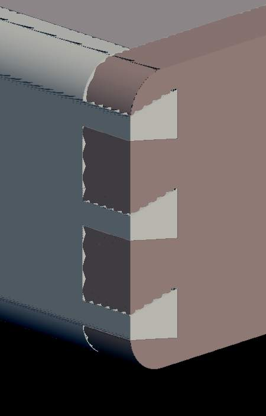
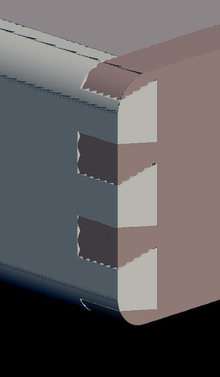
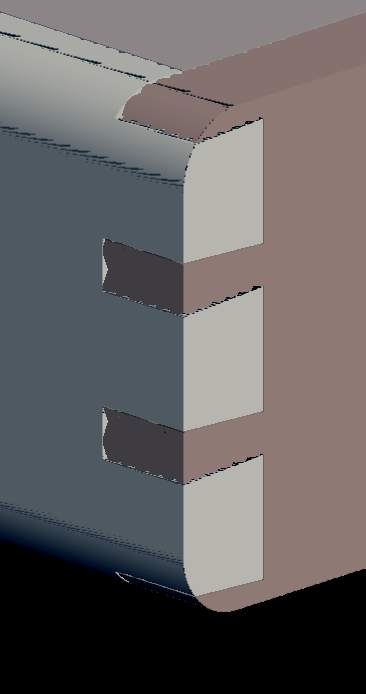

# Dovetailed Endtable

This was one of my earliest models. At the time I hadn't realized that you could name the flowchart elements, which is critical to keeping the project file understandable and maintainable. Looking back at this, I have no idea how it works. Nevertheless, I'm proud of it.

This table is fully parametric. You can adjust:

- Dovetail count and ratio
- Board thickness and width
- Overall table width and depth
- Lid angle

### Build notes

I've never tried to print this.

### Images

