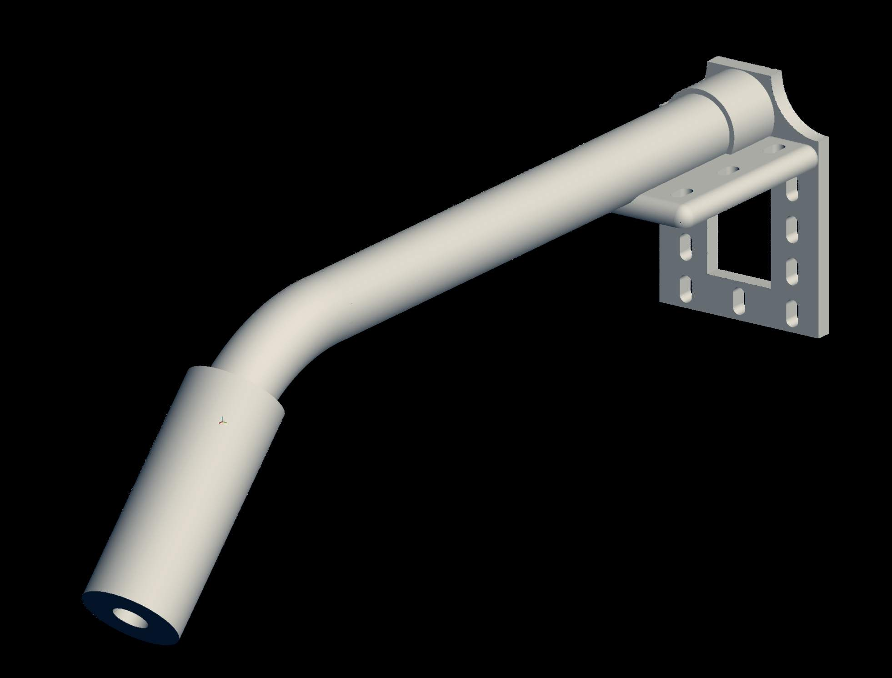
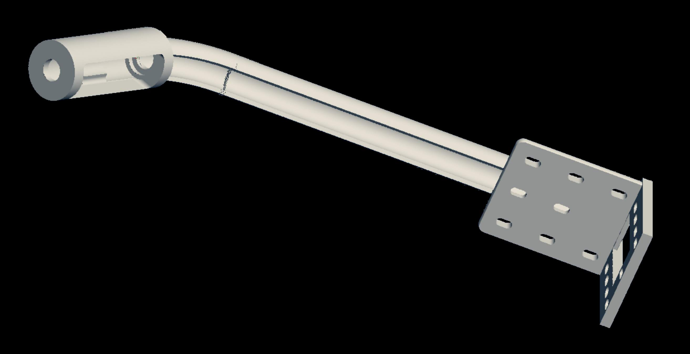

# Quick connect misting nozzle mount

This thing fits a 1/4" tee misting nozzle. The tubing is hidden as it runs under the arm, and a 1/4" stopper pins the tee to the assembly.

This was designed to be used with an automated plant misting/humidity control system. The perforated bracket is meant to be mounted to a mesh surface using zip ties.

### Usage notes

It's incredibly difficult/impossible to remove the tee fitting once you pin it with the plug.

### Build notes

Printed successfully using an FDM printer with a 0.8mm hotend using PETG.

### Images

